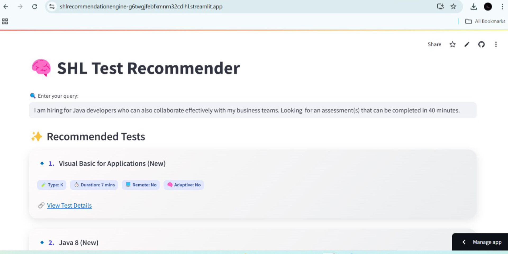

# SHL Test Recommendation System

This project recommends SHL tests based on user queries using semantic search with Sentence Transformers.

## 🔗 Live Demo
- **Frontend (Streamlit)**: https://shlrecommendationengine-g6twgjfebfxmnrn32cdihl.streamlit.app
- **API Endpoint (FastAPI)**: https://sailajap-shl-fastapi.hf.space



## 🛠️ Tools & Stack
- **Backend**: FastAPI + SentenceTransformers
- **Frontend**: Streamlit
- **Deployment**: Hugging Face Spaces
- **Vector Search**: Cosine similarity
- **Libraries**: pandas, scikit-learn, sentence-transformers

## 📦 Setup
```bash
pip install -r requirements.txt
python -m app.api  # Start backend
streamlit run app.py  # Start frontend
🧠 How it works
Load SHL test data and encode it using MiniLM Sentence Transformer.

Accept user query and convert it to embedding.

Compute similarity scores and return top matches.

Streamlit UI displays recommendations with test details.
📊 Evaluation
Use benchmark dataset to calculate:

Mean Recall@3

MAP@3   